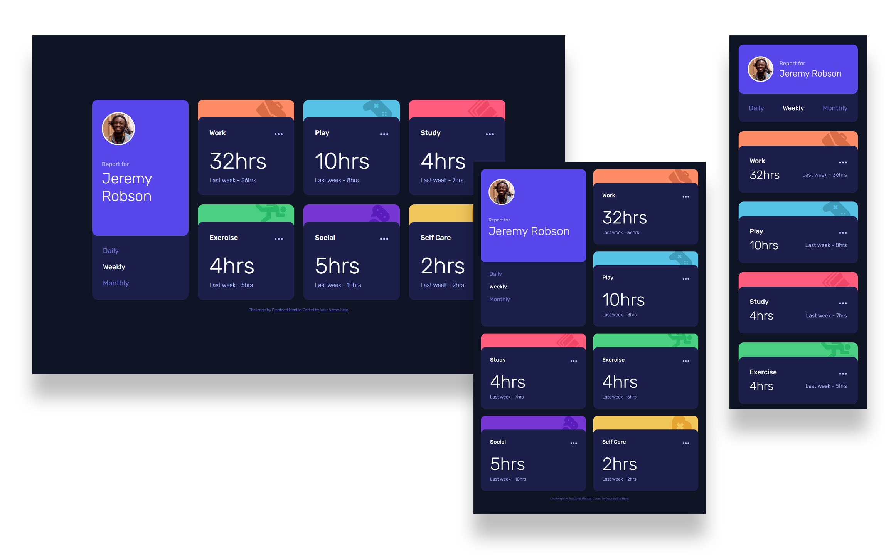

# Frontend Mentor - Time tracking dashboard solution

This is a solution to the [Time tracking dashboard challenge on Frontend Mentor](https://www.frontendmentor.io/challenges/time-tracking-dashboard-UIQ7167Jw).

## Table of contents

- [Overview](#overview)
  - [The challenge](#the-challenge)
  - [Screenshot](#screenshot)
  - [Links](#links)
- [My process](#my-process)
  - [Built with](#built-with)
- [Author](#author)

## Overview

### The challenge

Users should be able to:

- View the optimal layout for the site depending on their device's screen size
- See hover states for all interactive elements on the page
- Switch between viewing Daily, Weekly, and Monthly stats

### Screenshot

### Links

- Solution URL: [https://www.frontendmentor.io/solutions/time-tracking-dashboard-with-css-grid-v6fh02r7A](https://www.frontendmentor.io/solutions/time-tracking-dashboard-with-css-grid-v6fh02r7A)
- Live Site URL: [https://lukaszkus.github.io/time-tracking-dashboard/](https://lukaszkus.github.io/time-tracking-dashboard/)

## My process

### Built with

- Semantic HTML5 markup
- [Sass](https://sass-lang.com/) - CSS extension
- BEM methodology
- CSS Grid
- Flexbox
- Mobile-first workflow
- [Gulp](https://gulpjs.com/) - Task runner
- Vanilla JS

## Author

- Frontend Mentor - [@lukaszkus](https://www.frontendmentor.io/profile/lukaszkus)
